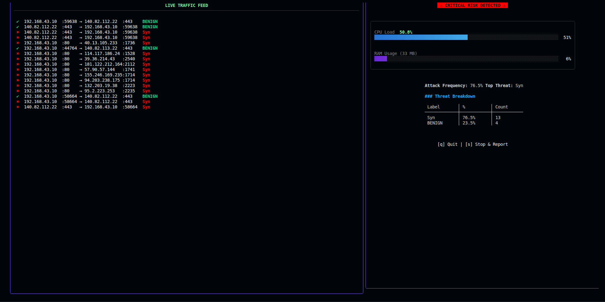

# Network Flow Analyzer

A real-time network traffic analysis and intrusion detection tool built in Go. Captures live packets or reads PCAP files, extracts **83 CICFlowMeter-compliant flow features**, classifies flows via a remote ML prediction API, and presents results through an interactive terminal dashboard.



## Features

- **Live & Offline Analysis** — Capture traffic from any network interface or analyze existing PCAP files
- **CICFlowMeter Feature Extraction** — Computes all 83 standard flow features including packet length statistics, inter-arrival times, TCP flag counts, bulk transfer metrics, and active/idle timing
- **ML-Powered Classification** — Sends feature vectors to a remote prediction server for flow classification (BENIGN / malicious)
- **Real-Time TUI Dashboard** — Split-pane terminal interface with live traffic feed, system risk level, attack distribution, and top threat identification
- **Incident Reporting** — Export analysis results and report incidents to a remote server via multipart POST

## Architecture

```
┌─────────────┐     ┌──────────────┐     ┌─────────────────┐
│  Packet     │────▶│  Flow Feature│────▶│  ML Prediction  │
│  Capture    │     │  Extraction  │     │  (Remote API)   │
└─────────────┘     └──────────────┘     └────────┬────────┘
                                                   │
                    ┌──────────────────────────────┘
                    ▼
          ┌──────────────────┐
          │  CSV Output      │
          │  + TUI Dashboard │
          └──────────────────┘
```

## Tech Stack

| Layer | Technology |
|---|---|
| Language | Go 1.24.5 |
| Packet Capture | [google/gopacket](https://github.com/google/gopacket) |
| TUI Framework | [charmbracelet/bubbletea](https://github.com/charmbracelet/bubbletea) |
| UI Components | [charmbracelet/bubbles](https://github.com/charmbracelet/bubbles) |
| Styling | [charmbracelet/lipgloss](https://github.com/charmbracelet/lipgloss) |

## Prerequisites

- Go 1.24.5+
- libpcap (required for live packet capture)
- A running ML prediction server at `http://localhost:5000` (optional — falls back to random labels)

## Installation

```bash
# Install libpcap (Debian/Ubuntu)
sudo apt-get install libpcap-dev

# Build the project
go build -o client .

# Run
sudo ./client          # live capture (may require root)
./client -file input.pcap  # offline PCAP analysis
```

## Usage

### Live Capture
```bash
sudo ./client
```
Select a network interface from the interactive menu to begin real-time analysis.

### Offline Analysis
```bash
./client
```
Select "Read from file" and choose a PCAP file.

### TUI Controls

| Key | Action |
|---|---|
| `s` | Stop capture and report incident |
| `q` / `ctrl+c` | Quit |
| Arrow keys | Navigate menus |

### Output

All flow data is written to `out.csv` with 83 feature columns plus the predicted label. The TUI provides real-time visualization of:

- Per-flow status (pending / BENIGN / attack)
- System risk level (SECURE / MODERATE / CRITICAL)
- Attack type distribution
- CPU and RAM load indicators

## API Endpoints

| Endpoint | Purpose |
|---|---|
| `POST /predict` | Submit feature vector for classification |
| `POST /reportIncident` | Upload CSV and report security incident |

## Project Structure

```
├── main.go              Entry point, launcher TUI, incident reporting
├── flowgen.go           Packet-to-flow dispatch and flow completion
├── csvwrite.go          CSV output utilities
├── gui/
│   ├── model.go         TUI model, view, and dashboard rendering
│   └── gui.go           ML prediction client
├── flowmetrics/         Statistical computation package
│   ├── duration.go
│   ├── packetIATStats.go
│   └── packetLengthStats.go
├── utils/               Utility package
│   ├── flowtermination.go
│   ├── activeidle.go
│   └── packetsize.go
├── go.mod / go.sum
└── input_example.pcap   Example PCAP for testing
```
